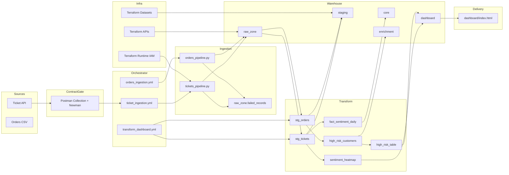
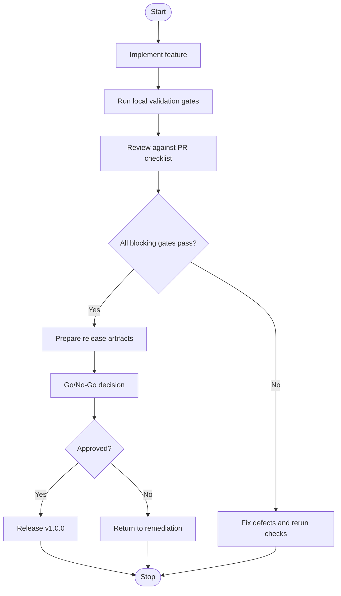
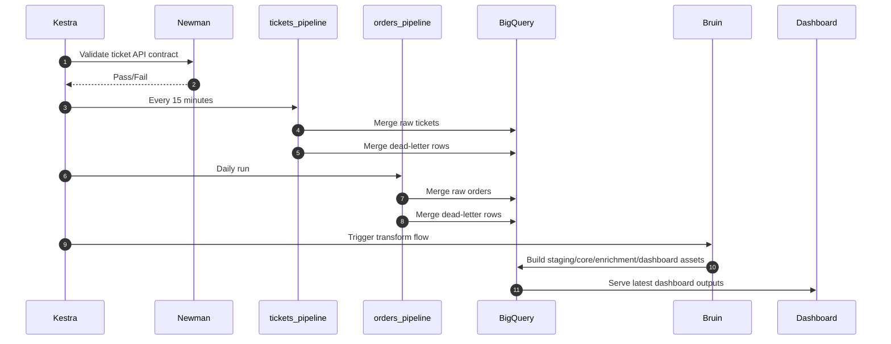

# Real-Time Customer Sentiment and Operational Efficiency Platform

[](https://opensource.org/licenses/MIT)

This repository delivers a production-grade MVP that correlates customer sentiment with operational delivery performance. The platform implements deterministic orchestration, layered warehouse modeling, idempotent ingestion, infrastructure as code, and API contract validation.

---
## Snapshot of Live Dashboard


---

## Enterprise Capabilities

- **Incremental & idempotent ingestion** using `dlt` merge semantics
- **Dead-letter handling** with a standardized schema and non-blocking pipeline continuation
- **Structured JSON logging** for traceable execution diagnostics
- **Kestra orchestration** with retries, timeouts, and dependency management
- **Newman pre-ingestion contract gating** to enforce API compatibility
- **Terraform-backed reproducibility** for core infrastructure (BigQuery, IAM, datasets)
- **Bruin SQL DAG execution** for layered warehouse modeling (raw → staging → core → enrichment → dashboard)
- **GitHub Actions CI/CD automation** for repeatable release gates and artifact builds
- **Centralized audit event logging** with compliance baseline checks
- **Synthetic load testing with thresholds** for parser and dedupe performance hardening
- **Production remote Terraform state governance** with encrypted backend patterns and bootstrap templates

---

## Architecture



---

## Release Lifecycle View



---

## Getting Started

### Prerequisites

- Python 3.9+
- Docker and Docker Compose
- Terraform (≥1.8) – optional, for infrastructure provisioning
- Google Cloud project with BigQuery enabled (for production deployment)

### Installation

```bash
git clone <repository-url>
cd customer-sentiment-platform
pip install -r requirements.txt
```

### Basic Validation

Run the full validation suite locally:

```bash
# Unit tests
python -m pytest -q

# Docker Compose configuration
docker compose config -q

# Terraform format and validation (no backend)
cd terraform
docker run --rm -v "${PWD}:/workspace" -w /workspace hashicorp/terraform:1.8.5 fmt -check -recursive
docker run --rm -v "${PWD}:/workspace" -w /workspace hashicorp/terraform:1.8.5 init -backend=false
docker run --rm -v "${PWD}:/workspace" -w /workspace hashicorp/terraform:1.8.5 validate
cd ..

# Start all services
docker compose up --build -d
```

### Optional Pipeline Execution

Run ingestion pipelines directly (bypassing Kestra):

```bash
python -m pipelines.tickets_pipeline
python -m pipelines.orders_pipeline
```

Execute the Bruin transformation DAG:

```bash
python -m pipelines.prepare_gcp_credentials
cd bruin
bruin run --config-file .bruin.yml
```

---

## Workflow Execution



---

## Project Structure

```
.
├── pipelines/                # Ingestion workloads and shared helpers
├── kestra/flows/             # Scheduled and dependency-triggered workflows
├── .github/workflows/        # CI/CD and release automation workflows
├── bruin/assets/             # SQL assets (source, staging, core, enrichment, dashboard)
├── postman/                  # Live API contract collection and environments
├── terraform/                # Infrastructure baseline (APIs, datasets, IAM)
│   └── state_bootstrap/      # Remote Terraform state bucket governance bootstrap
├── scripts/                  # Compliance checks, synthetic load suite, and mock API utilities
├── dashboard/                # Static enterprise-facing operational UI (Nginx)
├── tests/                    # Unit tests for ingestion and reliability helpers
├── docs/                     # Operational runbook
├── PR_tasks.md               # Release code review checklist
├── activity_tracking.md      # Expectation vs. actual tracking
└── requirements.txt
```

---

## Validation and Testing Commands

| Command | Purpose |
|---------|---------|
| `pip install -r requirements.txt` | Install dependencies |
| `python -m pytest -q` | Run unit test suite |
| `docker compose config -q` | Validate Compose configuration |
| `docker run ... terraform fmt -check -recursive` | Check Terraform formatting |
| `docker run ... terraform validate` | Validate Terraform configuration |
| `newman run postman/live_ticket_api.postman_collection.json --env-var ticketsApiUrl=<url>` | Run API contract checks |
| `python scripts/compliance_check.py --output compliance_report.json` | Verify hardening compliance controls |
| `python scripts/synthetic_load_test.py --output synthetic_load_report.json` | Run high-volume synthetic performance thresholds |
| `docker compose up --build -d` | Start all services |

> **Production Terraform backend:**  
> `docker run ... terraform init -backend-config=backend.hcl`

---

## Reliability and Enterprise Controls

- **Incremental & idempotent ingestion** – `dlt` merge semantics prevent duplicate processing.
- **Structured JSON logging** – Enables traceable execution diagnostics.
- **Dead-letter handling** – Non-blocking pipeline continuation with a standardized failure schema.
- **Kestra retries & timeouts** – Resilient orchestration for transient failures.
- **Newman pre-ingestion contract gating** – Blocks ingestion on API contract regressions.
- **Terraform-backed reproducibility** – Infrastructure dependencies (BigQuery datasets, IAM) are versioned and repeatable.
- **Centralized audit logging** – Pipelines emit append-only JSONL audit events with run-level correlation IDs.
- **Compliance integration** – Repository control baseline is machine-validated via scripts/compliance_check.py.

---

## Performance Metrics

Baseline measurements from release preparation runs:

| Metric | Target | Observed | Status |
| :--- | :---: | :---: | :--- |
| Unit tests | 100% pass | 8/8 passed in 8.80s | ✅ Pass |
| Compose validation | Valid config | `docker compose config` passed | ✅ Pass |
| Terraform format & validate | No errors | fmt + validate passed | ✅ Pass |
| API contract gate | 100% assertions | 3/3 passed, avg 314ms | ✅ Pass |
| Bruin transform DAG | 100% assets | 8/8 succeeded, 21.445s | ✅ Pass |
| Ticket ingestion runtime | < 5 min | ~49s | ✅ Pass |
| Orders ingestion runtime | < 10 min | ~29s | ✅ Pass |

Post-hardening validation snapshot (2026-04-07):

| Metric | Target | Observed | Status |
| :--- | :---: | :---: | :--- |
| Unit tests | 100% pass | 12/12 passed in 8.51s | ✅ Pass |
| Compliance controls | 100% pass | 7/7 controls passed | ✅ Pass |
| Synthetic ticket normalize | <= 8.0s | 0.411s for 20,000 records | ✅ Pass |
| Synthetic order normalize | <= 15.0s | 0.836s for 50,000 records | ✅ Pass |
| Synthetic order dedupe | <= 8.0s | 0.156s for 50,000 records | ✅ Pass |
| Runtime bootstrap | Services start cleanly | `docker compose up --build -d` passed locally | ✅ Pass |

**Warehouse snapshot during end-to-end validation:**

- `raw_zone.raw_tickets`: 52 rows
- `raw_zone.raw_orders`: 99,441 rows
- `staging.stg_tickets`: 52 rows
- `staging.stg_orders`: 99,441 rows
- `core.fact_sentiment_daily`: 33 rows

---

## Scaling and Performance Analysis

### Current Profile

- **Ticket flow** – 15-minute cadence, low-latency incremental pulls.
- **Orders flow** – Daily bulk batch with schema-safe casting and deduplication.
- **Transform flow** – Compact SQL DAG with sub-minute to low-minute execution at MVP volumes.

### Identified Bottlenecks

- API response latency and pagination limits on the ticket source.
- BigQuery query cost and slot contention under higher dashboard refresh frequency.
- Transform DAG window growth with increased retention and historical backfills.

### Scale-Up Strategy

1. **Source/API layer** – Introduce explicit pagination loops, backpressure controls, and rate-limit–aware retries.
2. **Warehouse layer** – Optimize partitioning/clustering for query predicates, adopt incremental model patterns for larger windows, and implement cost guardrails.
3. **Orchestration layer** – Separate high-frequency ingestion from heavier transforms, add SLA-based freshness/failure alerting.
4. **Infrastructure layer** – Extend Terraform modules for production deployment, promote environment-specific `tfvars` with peer-reviewed changes.

---

## Troubleshooting Runbook

Refer to the detailed operational runbook: [`docs/runbook.md`](docs/runbook.md)

| Incident | Symptoms | Resolution |
| :--- | :--- | :--- |
| Ticket API unavailable | Connection refused in tickets pipeline | Validate endpoint with Newman/Postman; restore availability |
| Newman contract failure | `validate_ticket_api_contract` task fails | Inspect response contract drift; resolve upstream API/schema mismatch |
| Bruin ADC credential failure | Bruin cannot locate default credentials | Run `pipelines.prepare_gcp_credentials` and map ADC path |
| Terraform init/validate failure | Provider or schema validation errors | Re-run `init -backend=false`, then `fmt` and `validate` |

---

## Infrastructure as Code (Terraform)

The `terraform/` directory provisions:

- **Required APIs** – BigQuery and IAM
- **Datasets** – `raw_zone`, `staging`, `core`, `enrichment`, `dashboard`
- **Optional runtime service account** and BigQuery project roles
- Typed variables and outputs for environment-safe usage
- `state_bootstrap/` templates to provision a governed remote state bucket (versioning, retention, public-access prevention)

Use `backend.hcl.example` for production-safe backend initialization with KMS encryption and service-account impersonation fields.

---

## CI/CD Automation

Implemented workflows:

- `.github/workflows/ci.yml`
  - Unit tests
  - Terraform fmt/init/validate
  - Newman API contract gating against a local synthetic endpoint
  - Compliance baseline checks
  - Synthetic load threshold suite
- `.github/workflows/release.yml`
  - Automated release build gates and versioned Docker artifact export

All workflows are configured to avoid paid cloud execution by default.

---

## API Contract Governance (Postman)

Implemented assets:

- `postman/live_ticket_api.postman_collection.json`
- `postman/environments/local.postman_environment.json`
- `postman/environments/production.template.postman_environment.json`

**Governance model:** Contract checks run as a mandatory pre-flight step in the `ticket_ingestion` flow. Ingestion is blocked if the API contract regresses.

---

## Release Readiness Artifacts

- `PR_tasks.md` – Pull request and release sign-off checklist
- `activity_tracking.md` – Expectation vs. actual mapping for implementation plan
- `Workflow_procecess.md` – Development and production operational governance

---

## Contributing

All contributions must follow the process and mandatory validation gates documented in [`CONTRIBUTING.md`](CONTRIBUTING.md). Every pull request should include:

- Scope summary
- Validation evidence
- Risk and rollback notes
- Documentation updates for any behavioral changes

---

## License

This project is released under the **MIT License** – see the [`LICENSE`](LICENSE) file for details.

---

## Version

**Current release:** `1.2.0`  
Version sources: `VERSION` file and the README header.

**Versioning scheme (Semantic Versioning):**

- **MAJOR** – Breaking architecture or contract changes
- **MINOR** – Backward-compatible feature additions
- **PATCH** – Fixes, hardening, and documentation maintenance

---

## Known Deferred Enterprise Hardening Items

The previously deferred controls have been implemented in this release:

- Full CI/CD workflow automation in the repository
- Centralized audit logging and compliance integration
- High-volume synthetic load-testing suite with automated thresholds
- Production-grade remote Terraform state governance
