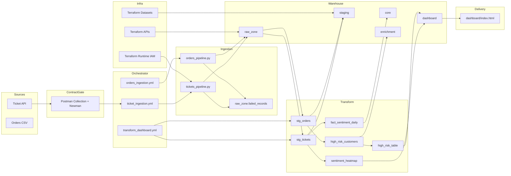
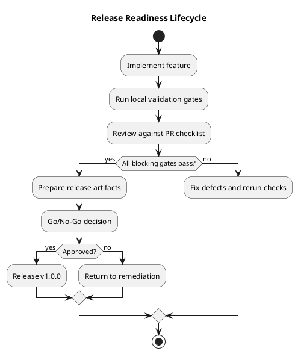
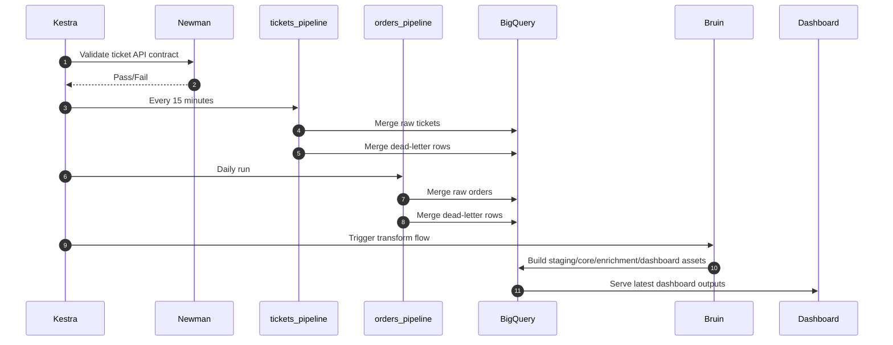

# Real-Time Customer Sentiment and Operational Efficiency Platform

Release: v1.1.0

This repository delivers a production-grade MVP for correlating customer sentiment with operational delivery performance. It is implemented with deterministic orchestration, layered warehouse modeling, idempotent ingestion, infrastructure as code, and API contract validation.

## 1. Enterprise Architecture

Core platform technologies:

- Python and dlt for incremental ingestion
- Kestra for orchestration and scheduling
- BigQuery for lakehouse-style storage and compute
- Bruin for SQL asset DAG execution
- Terraform for infrastructure baseline and IAM controls
- Postman and Newman for ticket API contract gates
- Nginx for static dashboard delivery

Additional release lifecycle view (PlantUML):

## 2. Workflow Execution

## 3. Project Structure

- pipelines/: ingestion workloads and shared helpers
- kestra/flows/: scheduled and dependency-triggered workflows
- bruin/assets/: source, staging, core, enrichment, dashboard SQL assets
- postman/: live API contract collection and environments
- terraform/: infrastructure baseline for APIs, datasets, IAM
- dashboard/: static enterprise-facing operational UI
- tests/: unit tests for ingestion and reliability helpers
- docs/: operational runbook
- PR_tasks.md: release code review checklist
- activity_tracking.md: implementation plan expectation-vs-actual tracking

## 4. Local and Release Validation Commands

1. Install dependencies

pip install -r requirements.txt

2. Run test suite

python -m pytest -q

3. Validate container composition

docker compose config -q

4. Validate Terraform

docker run --rm -v "${PWD}:/workspace" -w /workspace/terraform hashicorp/terraform:1.8.5 fmt -check -recursive
docker run --rm -v "${PWD}:/workspace" -w /workspace/terraform hashicorp/terraform:1.8.5 init -backend=false
docker run --rm -v "${PWD}:/workspace" -w /workspace/terraform hashicorp/terraform:1.8.5 validate

Production backend initialization (recommended):

docker run --rm -v "${PWD}:/workspace" -w /workspace/terraform hashicorp/terraform:1.8.5 init -backend-config=backend.hcl

5. Run API contract checks

docker run --rm -v "${PWD}:/app" -w /app platform-pipelines:latest sh -lc "newman run /app/postman/live_ticket_api.postman_collection.json --env-var ticketsApiUrl=http://host.docker.internal:9000/api/tickets --bail"

6. Start services

docker compose up --build -d

7. Optional direct pipeline execution

python -m pipelines.tickets_pipeline
python -m pipelines.orders_pipeline

8. Optional Bruin execution

python -m pipelines.prepare_gcp_credentials
cd bruin
bruin run --config-file .bruin.yml

## 5. Reliability and Enterprise Controls

- Incremental and idempotent ingestion with dlt merge semantics
- Structured JSON logging for traceable execution diagnostics
- Dead-letter handling with standardized schema and non-blocking pipeline continuation
- Kestra retries and timeouts for resilient orchestration
- Newman pre-ingestion contract gating for API compatibility safety
- Terraform-backed reproducibility for key infrastructure dependencies

## 6. Project Performance Metrics

Latest measured validation baselines (release preparation run):

| Metric | Target | Observed | Status |
|---|---:|---:|---|
| Unit tests | 100% pass | 8/8 passed in 8.80s | Pass |
| Compose validation | Valid config | docker compose config passed | Pass |
| Terraform format and validate | No errors | fmt check + validate passed | Pass |
| API contract gate | 100% assertions pass | 3/3 assertions passed, avg 314ms | Pass |
| Bruin transform DAG | 100% assets pass | 8/8 assets succeeded, 21.445s | Pass |
| Ticket ingestion runtime | < 5 min | ~49s in validated run | Pass |
| Orders ingestion runtime | < 10 min | ~29s in validated run | Pass |

Operational warehouse snapshot observed during end-to-end validation:

- raw_zone.raw_tickets: 52 rows
- raw_zone.raw_orders: 99,441 rows
- staging.stg_tickets: 52 rows
- staging.stg_orders: 99,441 rows
- core.fact_sentiment_daily: 33 rows

## 7. Scaling and Performance Analysis

Current scale profile:

- Ticket flow: designed for 15-minute cadence with low-latency incremental pulls
- Orders flow: daily bulk batch with schema-safe casting and deduplication
- Transform flow: compact SQL DAG with sub-minute to low-minute execution at MVP data volumes

Likely bottlenecks as volume grows:

- API response latency and pagination limits on ticket source
- BigQuery query cost and slot contention under higher dashboard refresh frequency
- Transform DAG window growth if retention and historical backfills increase

Scale-up strategy:

1. Source/API layer
- Introduce explicit pagination loops and backpressure controls
- Tune retry intervals based on provider-specific rate-limit headers

2. Warehouse layer
- Keep partition and clustering strategy optimized for query predicates
- Introduce incremental model patterns for larger historical windows
- Implement cost guardrails and scheduled usage reviews

3. Orchestration layer
- Separate high-frequency ingestion and heavier transform windows
- Add SLA-based alerting on freshness and failure thresholds

4. Infrastructure layer
- Extend Terraform modules for production deployment infrastructure
- Promote environment-specific tfvars with peer-reviewed change controls

## 8. Troubleshooting Runbook

Primary runbook file:

- docs/runbook.md

Most common operational incidents:

1. Ticket API unavailable
- Symptom: connection refused in tickets pipeline
- Action: validate endpoint with Newman/Postman and restore endpoint availability

2. Newman contract failure in Kestra preflight
- Symptom: validate_ticket_api_contract task fails
- Action: inspect response contract drift and resolve upstream API/schema mismatch

3. Bruin ADC credential failure
- Symptom: Bruin cannot locate default credentials
- Action: execute pipelines.prepare_gcp_credentials and map ADC path in runtime context

4. Terraform init/validate failure
- Symptom: provider or schema validation errors
- Action: rerun init with backend disabled, then fmt and validate

## 9. Terraform Scope

Implemented Terraform scope in terraform/:

- Required APIs: BigQuery and IAM
- Datasets: raw_zone, staging, core, enrichment, dashboard
- Optional runtime service account and BigQuery project roles
- Typed variables and outputs for environment-safe usage

Current scope intentionally excludes VM provisioning module and remote state backend configuration. Those are suitable as post-MVP hardening items.

## 10. Postman and Contract Governance Scope

Implemented Postman assets:

- postman/live_ticket_api.postman_collection.json
- postman/environments/local.postman_environment.json
- postman/environments/production.template.postman_environment.json

Governance model:

- Contract checks are integrated as mandatory preflight in ticket_ingestion flow
- Ingestion is blocked on API contract regression

## 11. Release Readiness Artifacts

- PR_tasks.md: pull request and release sign-off checklist
- activity_tracking.md: implementation plan expectation-vs-actual mapping
- Workflow_procecess.md: development and production operational governance

## 12. Contributing

Contributing process and mandatory validation gates are documented in:

- CONTRIBUTING.md

All pull requests should include:

- Scope summary
- Validation evidence
- Risk and rollback notes
- Documentation updates where behavior changed

## 13. Release License

This project is released under the MIT License.

- LICENSE

## 14. Version

Current release version:

- 1.0.0

Version sources:

- VERSION
- This README release header

Recommended versioning model:

- Semantic versioning: MAJOR.MINOR.PATCH
- MAJOR for breaking architecture/contract changes
- MINOR for backward-compatible feature additions
- PATCH for fixes, hardening, and documentation-only maintenance

## 15. Known Deferred Enterprise Hardening Items

The following controls are intentionally deferred and tracked for future releases:

- Full CI/CD workflow automation in repository
- Centralized audit logging and compliance integration
- High-volume synthetic load-testing suite with automated thresholds
- Production-grade remote Terraform state governance
