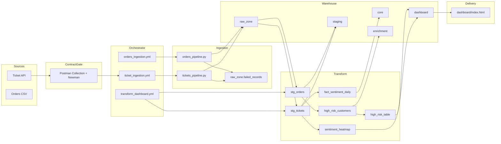
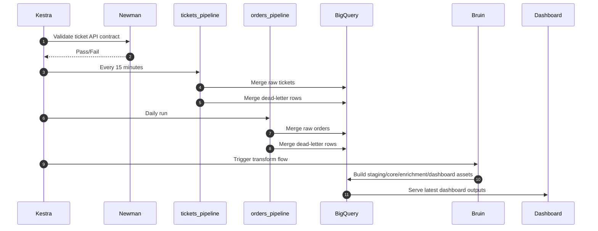

# Real-Time Customer Sentiment and Operational Efficiency Platform

Release: v1.1.0

This repository delivers a production-grade MVP for correlating customer sentiment with operational delivery performance using deterministic orchestration, layered warehouse modeling, idempotent ingestion, infrastructure as code, and API contract validation.

## Table of contents

- [Overview](#overview)
- [Architecture](#architecture)
- [Repository structure](#repository-structure)
- [Quick start](#quick-start)
- [Workflow execution](#workflow-execution)
- [Reliability controls](#reliability-controls)
- [Operational docs](#operational-docs)
- [Contributing](#contributing)
- [License](#license)
- [Versioning](#versioning)

## Overview

Core platform technologies:

- Python + `dlt` for ingestion
- Kestra for orchestration and scheduling
- BigQuery for storage and compute
- Bruin for SQL asset DAG execution
- Terraform for infrastructure and IAM
- Postman/Newman for contract validation
- Nginx for dashboard delivery

## Architecture



## Repository structure

- [`/pipelines`](/pipelines): ingestion workloads and shared helpers
- [`/kestra/flows`](/kestra/flows): scheduled workflows
- [`/bruin/assets`](/bruin/assets): source, staging, core, enrichment, dashboard SQL assets
- [`/postman`](/postman): API contract collection and environments
- [`/terraform`](/terraform): infrastructure baseline (APIs, datasets, IAM)
- [`/dashboard`](/dashboard): static operational UI
- [`/tests`](/tests): unit tests
- [`/docs/runbook.md`](/docs/runbook.md): troubleshooting and operations runbook
- [`/CONTRIBUTING.md`](/CONTRIBUTING.md): contribution and validation policy

## Quick start

1) Install dependencies:

```bash
pip install -r requirements.txt
```

2) Validate tests:

```bash
python -m pytest -q
```

3) Validate Docker compose:

```bash
docker compose config -q
```

4) Validate Terraform:

```bash
docker run --rm -v "${PWD}:/workspace" -w /workspace/terraform hashicorp/terraform:1.8.5 fmt -check -recursive
docker run --rm -v "${PWD}:/workspace" -w /workspace/terraform hashicorp/terraform:1.8.5 init -backend=false
docker run --rm -v "${PWD}:/workspace" -w /workspace/terraform hashicorp/terraform:1.8.5 validate
```

5) Run API contract check:

```bash
docker run --rm -v "${PWD}:/app" -w /app platform-pipelines:latest sh -lc "newman run /app/postman/live_ticket_api.postman_collection.json --env-var ticketsApiUrl=http://host.docker.internal:9000/api/tickets --bail"
```

6) Start services:

```bash
docker compose up --build -d
```

7) Optional direct pipeline execution:

```bash
python -m pipelines.tickets_pipeline
python -m pipelines.orders_pipeline
```

8) Optional Bruin execution:

```bash
python -m pipelines.prepare_gcp_credentials
cd bruin
bruin run --config-file .bruin.yml
```

## Workflow execution



## Reliability controls

- Incremental and idempotent ingestion with dlt merge semantics
- Structured JSON logging for execution diagnostics
- Dead-letter handling with non-blocking continuation
- Kestra retries and timeouts for resilient orchestration
- Newman pre-ingestion contract gating for API compatibility safety
- Terraform-backed reproducibility for infrastructure dependencies

## Operational docs

- Runbook: [`/docs/runbook.md`](/docs/runbook.md)
- Postman usage: [`/postman/README.md`](/postman/README.md)

## Contributing

See [`/CONTRIBUTING.md`](/CONTRIBUTING.md) for required validation and PR quality standards.

## License

Released under the MIT License. See [`/LICENSE`](/LICENSE).

## Versioning

Current release version: **v1.1.0**

Version sources:

- [`/VERSION`](/VERSION)
- This README release header

Recommended model: Semantic Versioning (`MAJOR.MINOR.PATCH`).
